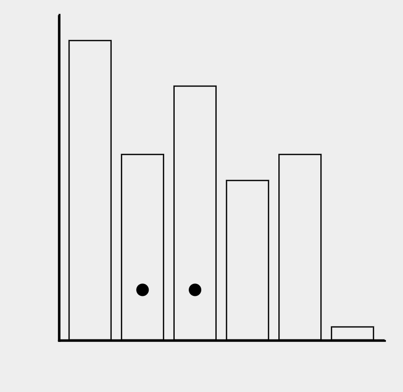
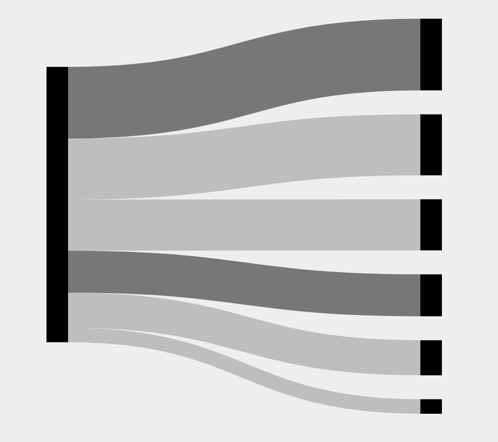
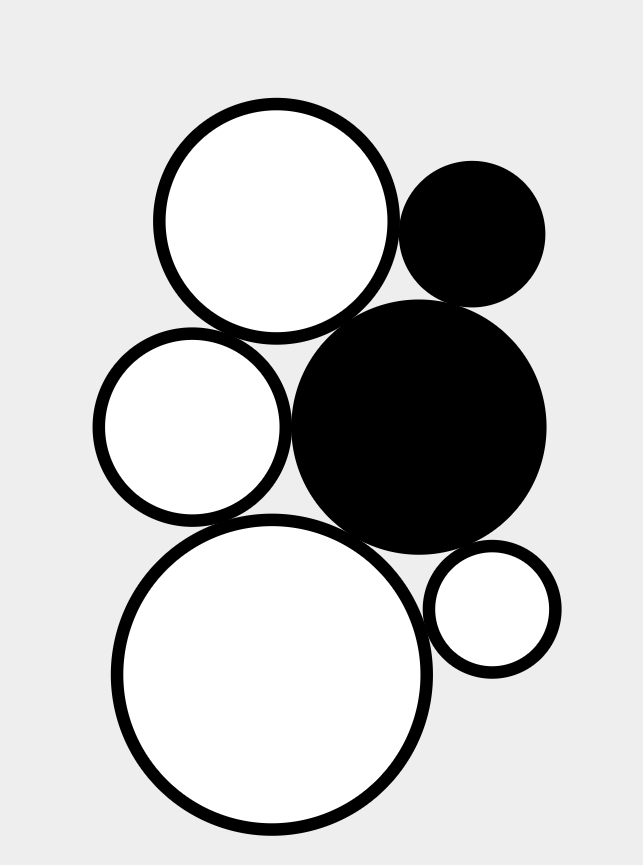
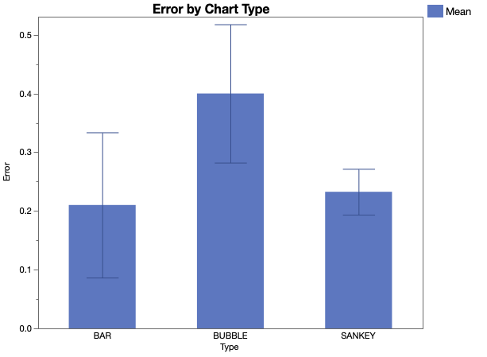
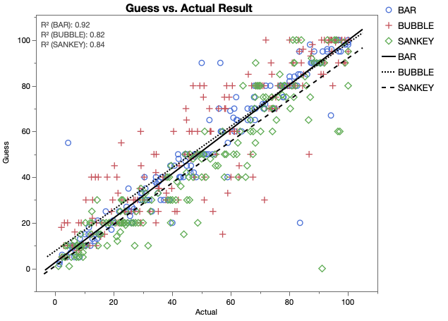

Description
---

Live Link
https://lockeanddemosthenes.github.io/03-Experiment/

The three charts we decided on were a bar graph, Sankey chart, and bubble (circular area) chart.





After being instructed on how the experiment would proceed, our 10 participants were given 20 charts of each type, with 6 randomized data values and 2 randomly selected.
The participants were asked what percentage of the larger selection was the smaller selection, and their results were recorded into a CSV table.
Afterwards, they downloaded their CSV file and sent it to us, where we processed it into a master spreadsheet, and determined the average log2Error and CI for each visualization.
Below is the comparison of our average log2Error values to the Cleveland results.


The average log2Error we receieved for the **bar chart** was **1.367**, slightly higher than the average value achieved in the Cleveland experiment, but firmly within the confidence interval.
The average log2Error we receieved for the **Sankey chart** was **2.277**, a fairly high result, around the Cleveland experiment's T4 value.
The average log2Error we receieved for the **bubble chart** was **2.532**, slightly lower than the Cleveland experiment's result but also firmly within the confidence interval.

Our confidence intervals are shown below.





Tech Achievements
---

For this project we used HTML elements to swap in the correct graph type that we desired for the testing. For passing the data we are using session storage in the browser, so that the data can all be managed by the central index.

For the graphs, all data is randomly generated for every trial and stored in a CSV download for the participant to send to us.

Design Achievements
---

The Sankey graph proved very difficult to work with, but we believe that it is presented in a proper and understandable manner.


References
---

Sankey chart code was referenced from https://bl.ocks.org/vasturiano/b0b14f2e58fdeb0da61e62d51c649908.
CSV download code was reference from https://code-maven.com/create-and-download-csv-with-javascript.

```
